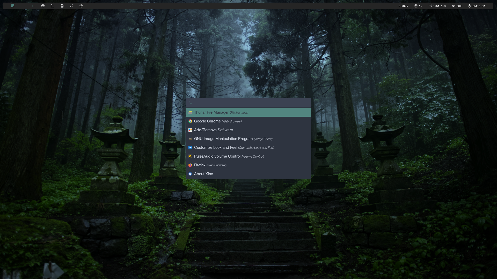

# bspwm-polybar

## Dependencies
`bspwm dunst hsetroot scrot rofi picom slop sxhkd xdo xsel xorg-xrdb xorg-xset xorg-xsetroot xsettingsd polybar xtitle python python-dbus pulseaudio pavucontrol rxvt-unicode ffmpeg viewnior mpv vim`

Install `polybar` and `xtitle` from AUR.

## Screenshots

